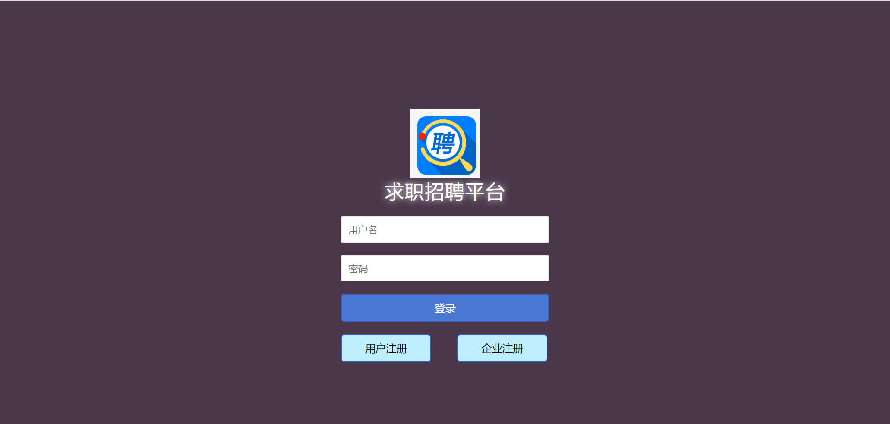
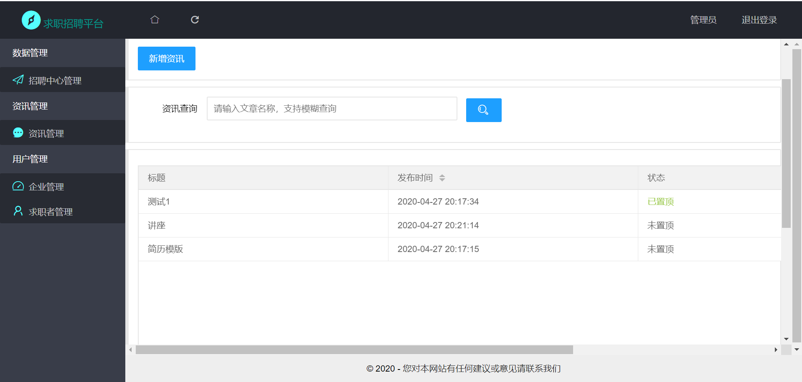
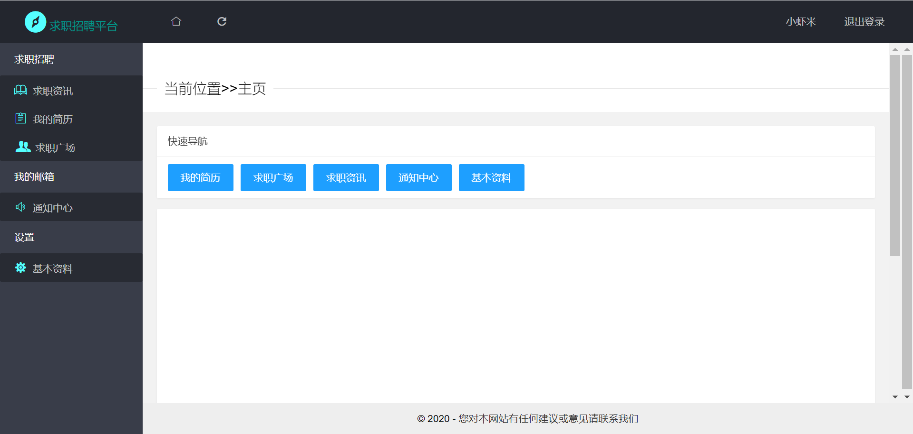
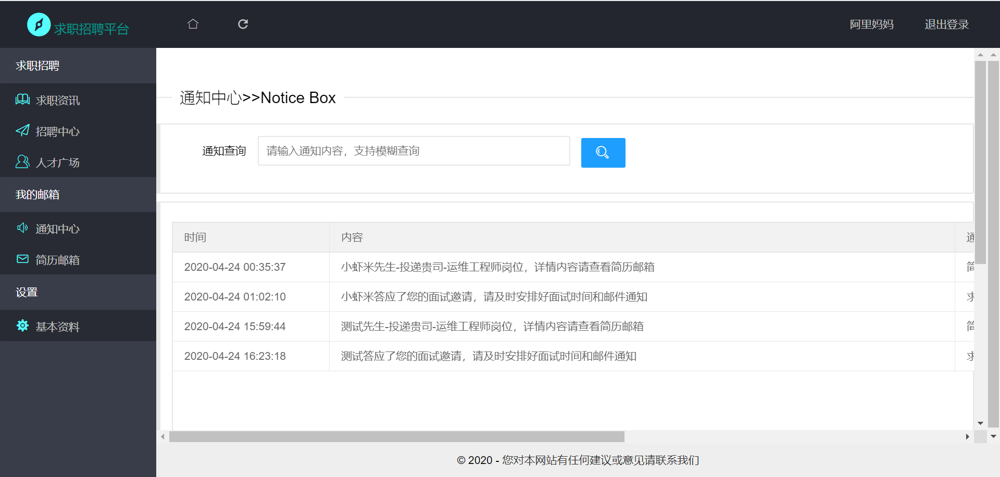

## 求职招聘系统

作者：亚双义、一真

时间：2020年4月6日~2020年4月7日

实现功能：三个用户：企业、求职者、平台管理员；支持在线查看简历、投递简历、下载简历等

实现技术：LayUI+asp.net MVC+SqlServer+echarts

平台：Visual Studio 2017

---

### 效果截图

- 登录界面

  

- 管理员

  

- 求职者

  

- 企业用户

  

---

### 备注

1. 数据库已放于项目根目录
2. 用低于2017版本的VS可能无法运行

